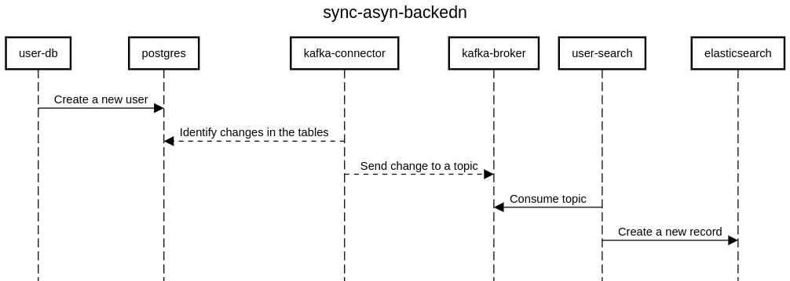

# Sync Async Backend

This application is a simple POC to show how to integrate two spring microservice using a sync and async communication.

This POC is using the following libraries:
1. Spring Boot
2. Spring Data JPA
3. Spring Data Elasticsearch
4. Spring for Apache Kafka
5. Spring Web
6. Lombok
7. Mapstruct
8. Spring Boot Actuator
9. Testcontainers
10. Springdoc-openapi

## Setup

To run the application we can use the docker compose file provided in the root of the project. The docker compose file will create all the containers from the `user-db` and `user-search`.

```sh
docker-compose up --build
```
Once the docker is up and running we need to enable the kafka connector to stream the changes from the `postgresql` to the `kafka` topic.
We need to access the `user-db` project and run the following command to enable the connector.
```sh
curl -i -X POST -H "Accept:application/json" -H "Content-Type:application/json" localhost:9090/connectors/ -d @config/pg_kafka_connector_config.json
```

This is a `curl` command to enable the connector through the `kafka-connector` API.

After those steps we can access the following url:
- [user-db](http://localhost:8080/swagger-ui/index.html#/) - The swagger interface about the user-db API.
- [user-search](http://localhost:8081/swagger-ui/index.html#/) - The swagger interface about the user-search API.
- [pgadmin](http://localhost:5050/) - The database interface.
  - We need to provide the following user and password to access the database interface:
    - Username: `admin@example.com`
    - Password: `admin`
  - Also, we need to use the password `admin` to access the database server.
- [kafka-ui](http://localhost:8082/) - The kafka interface.
- [kibana](http://localhost:5601/app/dev_tools#/console) - The interface to work with Elasticsearch.
  - Inside the Kibana we can run the following command to check the indices created.
    ```sh
    # List all the indices available
    GET _cat/indices

    # List records from user indices
    GET user/_search
    {
        "size": 100,
        "query": {
            "match_all": {}
        }
    }
    ```


## Architecture

The application uses a hexagonal architecture, where we have the application and adapters layer.
The application layer is responsible for the business rules and the domains.
The adapters layer is separated in two concepts, the inbound and outbound.
The inbound is responsible for exposing resources (API, Queue listener, ...) so that the application can receive communication from external services.
The outbound is responsible for communicating with external services (Database, Queue, API, ...), the application can communicate with external services through the outbound.

The `user-db` is working with `postgresql` and the `kafka-connector` is responsible to identify the changes in the tables
and stream those changes to the `kafka` topic.

Once the `kafka` topic receives the message, the `user-search` will consume the message and index the data in the `elasticsearch`.



